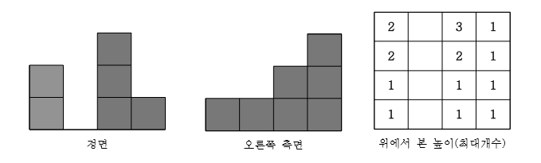

# 강의 문제 46~51

# 46

### 멀티 태스킹 ( 카카오 먹방 문제)

-다시풀기

- `80점` : 마지막에서 시간초과

    
  
  
    ```c++
    #include<vector>
    #include <iostream>
    #include<algorithm>
    
    using namespace std;
    
    
    int main() {
    	int N,k;
    	cin >> N;
    	vector<int> arr(N);
    	for (int i = 0; i < N; i++) {
    		cin >> arr[i];
    	}
    	cin >> k;
    	int index = 0;
    	int cnt = 0;
    	while (k--) {
    		if (index == N) index = 0;
    		if(arr[index]>0)arr[index]--;
    		else {
    			cnt = 0;
    			while (arr[index] == 0) {
    				if (index == N) index = 0;
    				index++; cnt++;
    				if (cnt >= N) break;
    			}
    			if (cnt < N) arr[index]--;
    	}
    	index++;
    }
    if (index == N) index = 0;
    cnt = 0;
    while (arr[index] == 0) {
    	if (index == N) index = 0;
    	index++; cnt++;
    	if (cnt >= N) break;
    }
    
    int ans = 0;
    
    if (cnt >= N) ans = -1;
    else ans = index+1;
    
    cout << ans << "\n";
    
    return 0;
    }
    ```
    

이유 알았으니 다음에 정신차리자

# 47

### 봉우리

지도 정보가 N*N 격자판에 주어집니다. 각 격자에는 그 지역의 높이가 쓰여있습니다. 각 격자 판의 숫자 중 자신의 상하좌우 숫자보다 큰 숫자는 봉우리 지역입니다. 봉우리 지역이 몇 개 있는 지 알아내는 프로그램을 작성하세요. 격자의 가장자리는 0으로 초기화 되었다고 가정한다. 만약 N=5 이고, 격자판의 숫자가 다음과 같다면 봉우리의 개수는 10개입니다.
0 0 0 0 0 0 0
0 5 3 7 2 3 0
0 3 7 1 6 1 0
0 7 2 5 3 4 0
0 4 3 6 4 1 0
0 8 7 3 5 2 0
0 0 0 0 0 0 0

```c++
#include <vector>
#include <iostream>
#include <algorithm>

using namespace std;

int arr[52][52];
int N;
int dx[] = { 1,-1, 0, 0 };
int dy[] = { 0, 0, 1, -1 };

int main() {
	cin >> N;
	for (int i = 1; i <= N; i++) {
		for (int j = 1; j <= N; j++) {
			cin >> arr[i][j];
		}
	}
	int cnt = 0;
	for (int i = 1; i <= N; i++) {
		for (int j = 1; j <= N; j++) {
			int x = i; int y = j;
			bool isTop = true;
			for (int k = 0; k < 4; k++) {
				int nx = x + dx[k];
				int ny = y + dy[k];
				if (arr[nx][ny] >= arr[x][y]) {
					isTop = false; break;
				}
			}
			if (isTop==true) cnt++;
		}
	}
	cout << cnt << "\n";
	return 0;
}
```

**조건문 잘 볼것!!!!! 가장 큰이니깐 같은것도 안됨!!!!!!!!!!!!!!!!!**

case in/out 확인할 수 있어서 수정했지 안 그랬으면 끝까지 몰랐음!!!!

# 48

### 각 행의 평균과 가장 가까운 값

<그림 1>과 같이 9 × 9 격자판에 쓰여진 81개의 자연수가 주어질 때, 각 행의 평균을 구하고, 그 평균과 가장 가까운 값을 출력하는 프로그램을 작성하세요. 평균은 소수점 첫 째 자리에서 반 올림합니다. 평균과 가까운 값이 두 개이면 그 중 큰 값을 출력하세요.

```c++
#include <vector>
#include <iostream>
#include <algorithm>

using namespace std;

int arr[10][10];
int returnAvg(int row) {
	float x = 0;
	for (int i = 1; i <= 9; i++) {
		x += arr[row][i];
	}
	int y = x / 9;
	x = x / 9;
	if (x - y >= 0.5) y++;
	return y;
}

int findCloser(int row, int x) {
	int min = 987654321;
	int index = -1;
	for (int i = 1; i <= 9; i++) {
		if (abs(x - arr[row][i]) <= min) {
			if (min == abs(x - arr[row][i])) {
				if (arr[row][i] > arr[row][index]) index = i;
			}
			else {
				min = abs(x - arr[row][i]);
				index = i;
			}
		}
	}
	return arr[row][index];
}

int main() {
	for (int i = 1; i <= 9; i++) {
		for (int j = 1; j <= 9; j++) {
			cin >> arr[i][j];
		}
	}
	for (int i = 1; i <= 9; i++) {
		int x = returnAvg(i);
		int closerNum = findCloser(i, x);
		cout << x << " " << closerNum << "\n";
	}
	
	return 0;
}
```

​    

# 49

### 블록의 최댓값

현수는 블록놀이를 좋아합니다. 현수에게 정면에서 본 단면과 오른쪽 측면에서 본 단면을 주 고 최대 블록개수를 사용하여 정면과 오른쪽 측면에서 본 모습으로 블록을 쌓으라 했습니다. 현수가 블록을 쌓는데 사용해야 할 최대 개수를 출력하는 프로그램을 작성하세요.



위에서 봤을 때 각 칸의 블록의 개수입니다. 정면에서의 높이 정보와 오른쪽 측면에서의 높이 정보가 주어지면 사용할 수 있는 블록의 쵀대 개수를 출력하세요.

```c++
#include <vector>
#include <iostream>
#include <algorithm>

using namespace std;

int arr[11][11];
int row[11];
int col[11];

int main() {
	int N;
	cin >> N;
	for (int y = 0; y < N; y++) {
		cin >> col[y];
	}
	for (int x = N-1; x >=0; x--) {
		cin >> row[x];
	}
	for (int i = 0; i < N; i++) {
		for (int j = 0; j < N; j++) {
			if(col[j] <= row[i]) arr[i][j] = col[j];
			else arr[i][j] = row[i];
		}
	}
	int sum = 0;
	for (int i = 0; i < N; i++) {
		for (int j = 0; j < N; j++) {
			sum += arr[i][j];
		}
	}
	cout << sum << "\n";
	return 0;
}
```

- 정면이 열값이고
- 우측면이 행값이다 (거꾸로 집어넣어야하는게 포인트)


# 50

### 영지 선택 : small

세종대왕은 현수에게 현수가 다스릴 수 있는 영지를 하사하기로 했다. 전체 땅은 사각형으로 표 시된다. 그 사각형의 땅 중에서 세종대왕이 현수가 다스릴 수 있는 땅의 크기(세로의 길이와 가 로의 길이)를 정해주면 전체 땅 중에서 그 크기의 땅의 위치를 현수가 정하면 되는 것이다. 전체 땅은 사각형의 모양의 격자로 되어 있으며, 그 사각형 땅 안에는 많은 오렌지 나무가 심 겨져 있다. 현수는 오렌지를 무척 좋아하여 오렌지 나무가 가장 많이 포함되는 지역을 선택하 고 싶어 한다. 현수가 얻을 수 있는 영지의 오렌지 나무 최대 개수를 출력하는 프로그램을 작 성하세요. 다음과 같은 땅의 정보가 주어지고, 현수가 하사받을 크기가, 가로 2, 세로 3의 크 기이면 가장 많은 오렌지 나무가 있는 영지는 총 오렌지 나무의 개수가 16인 3행 4열부터 시 작하는 구역이다.
3 5 1 3 1 3 2
1 2 1 3 1 1 2
1 3 1 5 1 3 4
5 1 1 3 1 3 2
3 1 1 3 1 1 2
1 3 1 3 1 2 2

```c++
#include <vector>
#include <iostream>
#include <algorithm>

using namespace std;

int arr[51][51];

int main() {
	int H, W,h,w;
	cin >> H >> W;
	for (int i = 0; i < H; i++) {
		for (int j = 0; j < W; j++) {
			cin >> arr[i][j];
		}
	}
	int max = -987654321;
	cin >> h >> w;
	for (int i = 0; i <= H - h; i++) {
		for (int j = 0; j <= W - w; j++) {
			int sum = 0;
			for (int k = i; k < i + h; k++) {
				for (int l = j; l < j + w; l++) {
					sum += arr[k][l];
				}
			}
			if (max < sum) max = sum;
		}
	}
	cout << max << "\n";
	return 0;
}
```

# 51

### 영지 선택: large


`2개만 통과`

```c++
#include <vector>
#include <iostream>
#include <algorithm>

using namespace std;

int arr[51][51];

int main() {
	int H, W,h,w;
	cin >> H >> W;
	for (int i = 0; i < H; i++) {
		for (int j = 0; j < W; j++) {
			cin >> arr[i][j];
		}
	}
	int max = -987654321;
	cin >> h >> w;
	int i = 0, j = 0;
	while (1) {
		int sum = 0;
		for (int k = i; k < i + h; k++) {
			for (int l = j; l < j + w; l++) {
				sum += arr[k][l];
			}
		}
		if (max < sum) max = sum;
		j++;
		if (j > W - w) {
			i++;
			j = 0;
		}
		if (i > H - h) break;
	}
	cout << max << "\n";
	return 0;
}
```

**강의 답**

### Dp 이용!

```c++
#include <vector>
#include <iostream>
#include <algorithm>

using namespace std;

int dp[701][701];
int arr[701][701];

int main() {
	int H, W, h, w;
	cin >> H >> W;
	for (int i = 1; i <= H; i++) {
		for (int j = 1; j <= W; j++) {
			cin >> arr[i][j];
			dp[i][j] = dp[i][j - 1] + dp[i - 1][j] - dp[i - 1][j - 1] + arr[i][j];
		}
	}
	cin >> h >> w;
	int max = -987654321;
	int sum = 0;
	for (int i = h; i <= H; i++) {
		for (int j = w; j <= W; j++) {
			sum = dp[i][j] - dp[i - h][j] - dp[i][j - w] + dp[i - h][j - w];
			if (max < sum) max = sum;
		}
	}
	cout << max << "\n";
	return 0;
}
```

개천재.. 풀이

그치만 마지막에서 타임리밋나는데

강의 답은

```c++
#include <iostream>
#include<stdio.h>
#include<vector>
#include<algorithm>
using namespace std;
int a[701][701], dy[701][701];
int main() {
	
	int h, w, n, m, i, j, tmp, max = -2147000000;
	scanf("%d %d", &h, &w);
	for (i = 1; i <= h; i++) {
		for (j = 1; j <= w; j++) {
			scanf("%d", &a[i][j]);
			dy[i][j] = dy[i - 1][j] + dy[i][j - 1] - dy[i - 1][j - 1] + a[i][j];
		}
	}
	scanf("%d %d", &n, &m);
	for (i = n; i <= h; i++) {
		for (j = m; j <= w; j++) {
			tmp = dy[i][j] - dy[i - n][j] - dy[i][j - m] + dy[i - n][j - m];
			if (tmp > max) max = tmp;
		}
	}
	printf("%d\n", max);
	return 0;
}
```

이거임 확실히 scanf가 빠른듯