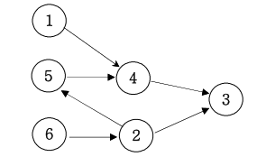

# 위상정렬

**일의 선후 관계를 유지하면서 전체 일의 순서를 짜는 알고리즘**

주로 일의 순서를 따질 때 쓴다.

위상정렬은 어떤 일을 하는 순서를 찾는 알고리즘입니다. 각각의 일의 선후관계가 복잡하게 얽혀있을 때 각각 일의 선후관계를 유지하면서 전체 일의 순서를 짜는 알고리즘입니다. 만약 아래와 같은 일의 순서를 각각 지키면서 전체 일의 순서를 정한다면 

1 4 //1번일을 하고 난 후 4번일을 해야한다. 

5 4 

4 3 

2 5 

2 3 

6 2



전체 일의 순서는 1, 6, 2, 5, 4, 3과 같이 정할 수 있다. 전체 일의 순서는 여러 가지가 있습 니다 그 중에 하나입니다.

▣ 입력설명 

첫 번째 줄에 전체 일의 개수 N과 일의 순서 정보의 개수 M이 주어집니다. 두 번째 줄부터 M개의 정보가 주어집니다.
▣ 출력설명 

전체 일의 순서를 출력합니다.

▣ 입력예제 1 

6 6 

1 4 

5 4 

4 3 

2 5 

2 3 

6 2

▣ 출력예제 1 

1 6 2 5 4 3

`내가 짠 코드`

```c++
#include <string>
#include <vector>
#include <iostream>
#include <algorithm>
#include <queue>

using namespace std;

int degree[51];
bool ch[51];
vector<int> work[51];

int main() {
	ios_base::sync_with_stdio(false);
	int N,M;
	cin >> N >> M;
	
	for (int i = 0; i < M; i++) {
		int x, y;
		cin >> x >> y;
		work[x].push_back(y);
		degree[y]++;
	}
	queue<int> q;
	for (int i = 1; i <= N; i++) {
		if (degree[i] == 0) {
			q.push(i);
			ch[i] = true;
		}
	}
	while (!q.empty()) {
		int index = q.front();
		cout << index << " ";
		q.pop();
		for (int i = 0; i < work[index].size(); i++) {
			degree[work[index][i]]--;
		}
		for (int i = 1; i <= N; i++) {
			if (degree[i] == 0 && !ch[i]) {
				q.push(i);
				ch[i] = true;
			}
		}
	}
	return 0;
}
```

`소스코드`

```c++
#include<bits/stdc++.h>
using namespace std;
int main(){
	ios_base::sync_with_stdio(false);
	freopen("input.txt", "rt", stdin);	
	int n, m, a, b, score;
	cin>>n>>m;
	vector<vector<int> > graph(n+1, vector<int>(n+1, 0));
	vector<int> degree(n+1);
	queue<int> Q;
	for(int i=0; i<m; i++){
		cin>>a>>b;
		graph[a][b]=1;
		degree[b]++;
	}
	for(int i=1; i<=n; i++){
		if(degree[i]==0) Q.push(i);
	}
	while(!Q.empty()){
		int now=Q.front();
		Q.pop();
		cout<<now<<" ";
		for(int i=1; i<=n; i++){
			if(graph[now][i]==1){
				degree[i]--;
				if(degree[i]==0) Q.push(i);
			}
		}
	}
	return 0;
}
```

→아 소스코드는 이차원 행렬 식으로 짰다. 그래서 degree 배열하고 맞물려서 빼고 바로 0되면 넣을 수 있게.

나처럼 체크 배열 굳이 없어도 될듯.. 더 간단하다.